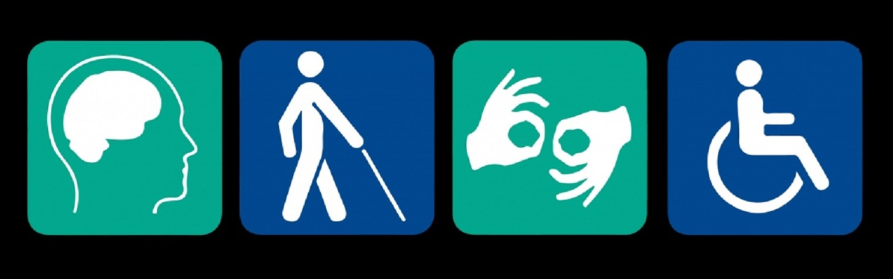

<!-- .slide: data-menu-title="Title page" data-background-image="images/TG-on-white.png" data-background-opacity="1.0" -->
## Adviseur Toegankelijkheid

Note:
  Webserver presentation, so start server in slides directory
  Slides reside in repository in Projects folder:
  MacOS
    Start server in terminal window (i.e. in slides directory)
      python -m SimpleHTTPServer (Python2)
      python3 -m http.server 9000 (Python3)
    View by browsing to:
      http://localhost:8000 (Python2)
      http://localhost:9000 (Python3)
  Windows:
    Install extension: HTTP Server / HTML Preview
    Start server in terminal window
      Press <Fn> & F1
      Type: Simple HTTP server: Create HTTP Server <enter>
      Choose where it should run
  Hidden features:
  - Speaker notes window : hit »S« on your keyboard.
  - Pause presentation :  hit »B« or ».«
  - Show menu: hit »M«
  Printing
  -  http://localhost:8000/?print-pdf
  -  http://localhost:8000/?print-pdf&showNotes=true
  -  Open the in-browser print dialog (CTRL/CMD+P).
    -  Change the Destination setting to Save as PDF.
    -  Change the Layout to Landscape.
    -  Change the Margins to None.
    -  Enable the Background graphics option.
    -  Click Save.

---

<!-- .slide: data-menu-title="Introductie" -->
## Website Toegankelijk Groningen

Documentatie voor Adviseurs Toegankelijkheid

- Toegankelijkheids informatie wordt opgeslagen in objecten 
- Objecten zijn vaak gebouwen, maar bijv. ook toiletten
- Op de volgende pagina's staan alle activiteiten beschreven
- Kies een titel in de inhoudsopgave om daarheen te gaan

--

## Introductie

Voor het publiceren van objecten heb je 2 rollen nodig:
- Adviseur : voert object gegevens in
- Regio beheerder : controleert en publiceert object gegevens

--

## Handicap breed

- beperkte mobiliteit
- beperkt zicht
- beperkt gehoor

Note:
- psychisch beperkt: ook ADHD, Autisme hebben we nog niets voor
- Verstandelijk beperkt: ook Dementie, idem dito

---

<!-- .slide: data-menu-title="Inhoudsopgave" -->
## Inhoudsopgave:

1. Nieuwe Adviseur
2. Inloggen
3. Objecten pagina
4. Aanmaken nieuw object

---

<!-- .slide: data-menu-title="Nieuwe adviseur" -->
## Nieuwe adviseur

- Adviseur kan objecten aanmaken of aanpassen
- Hiervoor heb je een login nodig
- Een login kun je aanvragen bij je Regio beheerder
- De regio beheerder mailt je dan jouw 'Login'
- Daarna sms't hij je jouw 'Wachtwoord'
- Dat zijn jouw unieke persoonlijke gegevens
- Dus voor jezelf houden en niet delen met anderen
- Als je die gegevens hebt ga je naar 'Inloggen'

--

<!-- .slide: data-menu-title="Inloggen" -->
## Inloggen

Op de volgende pagina's zie je:

- Toegankelijk Groningen website
- Waar de login te vinden is

--

<!-- .slide: data-background-image="images/TG-website.png" data-background-opacity="1.0" -->
## (1))

--

<!-- .slide: data-background-image="images/TG-website-Login.png" data-background-opacity="1.0" -->
## (2)

--

<!-- .slide: data-background-image="images/TG-website-Login-form.png" data-background-opacity="1.0" -->
## (3)

--

<!-- .slide: data-background-image="images/TG-website-Login-form-data.png" data-background-opacity="1.0" -->
## (4)

--

<!-- .slide: data-background-image="images/TG-website-Adviseur-loggedin.png" data-background-opacity="1.0" -->
## (5)

---

<!-- .slide: data-menu-title="Objecten pagina" -->
## Objecten pagina

--

## Openbare ruimte (2)

Note:
- Bewustwording overheid & uitvoerders
- Niet alleen issue voor rolstoelen, ook blinden, rollators, kinderwagens

--

## Wat is Toegankelijkheid

 Is dit fysieke toegankelijkheid?

 Dat is uiteraard randvoorwaarde!

 Maar er is zoveel meer...

---

<!-- .slide: data-menu-title="VN-Verdrag Handicap" -->
## VN-Verdrag Handicap

Verdrag is in 2006 door de Verenigde Naties aangenomen

Door Nederland geratificeerd in 2016

College voor de rechten van de mens: jaarlijks rapport
Bron zijn mensen en organisaties

Note:
- Officieel: "VN-Verdrag inzake de rechten van personen met een handicap"
- Amendement Van der Staaij en Bergkamp ter vervanging van nr. 19:
- Het is de bedoeling van de indieners dat gemeenten één integraal plan ontwikkelen voor het hele sociale domein. Concreet kan dit worden uitgewerkt in een Lokale Inclusie Agenda. Het is uitdrukkelijk de bedoeling van de indieners dat mensen met een beperking en hun vertegenwoordigende organisaties bij het opstellen van het beleid betrokken worden.
- VN-verdrag: niet vrijblijvend, gemeenten moeten plan maken hoe ze hier uitvoering aan geven!
- Dit rapport gaat over de eerste twee jaar van het VN-verdrag in Nederland.
- Het College krijgt officiele input Nederlandse overheid.
- Schaduwrapportage door Alliantie VN-Verdrag o.v.v. VN-comité in Genève:
  Niet vanuit NL overheid maar: belangenorganisaties & ervaringsdeskundigen.
- En met organisaties voor en door mensen met een beperking.
- Planning VN-Verdrag Handicap: 10 minuten, dus tot 14:30

--

## Dit gaat goed

--

## Dit gaat minder goed

**Algemeen**

--

## Gelijkheid voor de wet

--

## Maatschappelijke ondersteuning

Note:
- Bijvoorbeeld Alle 75+ een WMO taxipas: goedkoper als alle keuringsheisa.
- Handicap toerisme

--

## Gezondheid

--

## Onderwijs

--

## Arbeidsmogelijkheden

---

<!-- .slide: data-menu-title="VNG aanpak" -->
## VNG Aanpak

Nederland: 355 gemeenten

VNG Koplopersprogramma VN-Verdrag Handicap

26 koploper gemeentes geselecteerd

- informatie delen
- goede voorbeelden zichtbaar maken
- lopende initiatieven groter maken

Note:
- Planning VNG aanpak: 10 minuten, dus tot 14:40

--

## Om wie gaat het

--

## Locale inclusie kaart

Note:
- Niets over ons zonder ons

--

<!-- .slide: data-background-image="images/businessman.png" data-background-opacity="1.0" -->
## Inspiratiebundel

Note:
 - Inspiratiebundel door Movisie & VNG
 - Goede voorbeelden op www.vng.nl/iedereen-doet-mee

--

## Organiseer ervaringsdeskundigheid

- Willen
  - Locale inclusie agenda
- Kunnen
  - Beleidsmedewerker Inclusie
- Doen
  - Leren door te doen
  - Stap voor stap

Note:
- Willen
  - Gemeente en ervaringsdeskundigen
  - Vergroten: Ervaringsparcoursen en -verhalen: resultaat motiveert, waardering ook.
  - Voordelen: kostenbesparend, draagvlak door vooraf te checken met (beperkte) inwoners
- Kunnen
  - Besef dat je dat moet organiseren; gebruik bestaande bronnen: adviesraden (check vertegenwoordiging beperkten)
  - Wees uitnodigend, vraag individuen; Sta open voor ongevraagd advies

---

<!-- .slide: data-menu-title="Toegankelijkheid Handvatten" data-background-image="images/raising_questions.jpg" data-background-opacity="0.2" -->
## Toegankelijkheid - Handvatten?

Eenvoudige vraag:

**Wat zijn de eisen, waaraan moet het voldoen?**

Note:
- Gemeente vraagt over toegankelijkheid gebouwem: geef ons de normen
- Planning handvatten: 10 minuten, dus tot 14:50

--

## Standaarden

- Bouwbesluit 2012
- Handboek voor Toegankelijkheid
- Vanuit Toegankelijk Groningen:
  - Handreiking Toegankelijkheid 2017
  - Integrale Toegankelijkheid v1.2

**Maar...**                      <!-- .element: class="fragment" data-fragment-index="1" -->

- Veel ruimte voor interpretatie <!-- .element: class="fragment" data-fragment-index="1" -->
- Navolging soms beperkt         <!-- .element: class="fragment" data-fragment-index="1" -->
- Wachten op bouwbesluit?        <!-- .element: class="fragment" data-fragment-index="1" -->

--

## Keurmerken

- ITS van PBTconsult
- NL keurmerk voor Toegankelijkheid
- Talloze lokale keurmerken

**Maar...** <!-- .element: class="fragment" data-fragment-index="1" -->

- Kostbaar                 <!-- .element: class="fragment" data-fragment-index="1" -->
- Beperkt houdbaar         <!-- .element: class="fragment" data-fragment-index="1" -->
- Niet open                <!-- .element: class="fragment" data-fragment-index="1" -->
- Teveel bomen in het bos  <!-- .element: class="fragment" data-fragment-index="1" -->

--

<!-- .slide: data-background-image="images/exploding_head.png" data-background-opacity="0.2" -->
## Hoe verder...

- Ontoegankelijkheid is vaak geen opzet       <!-- .element: class="fragment" data-fragment-index="1" -->
- Laat beslissers zelf ervaren                <!-- .element: class="fragment" data-fragment-index="2" -->
- Het begint met er over praten: (h)erkennen  <!-- .element: class="fragment" data-fragment-index="3" -->
- Vraag mensen die dat ondervinden:           <!-- .element: class="fragment" data-fragment-index="4" -->
  Ervaringsdeskundigen kunnen helpen          <!-- .element: class="fragment" data-fragment-index="4" -->

**Zoek ervaringsdeskundigen en betrek ze!**   <!-- .element: class="fragment" data-fragment-index="5" -->

Note:
- Vaak geen opzet, onwil, of doel maar onwetendheid, of angst/handelingsverlegenheid
- Zelf ervaren (geef de wethouder een handicap): dat geeft pas echt inzicht!
- Vraag individuen, niet eeen groep: iedereen is anders en heeft specifieke punten
- Belangen van groepen kunnen verschillen of zelfs tegengesteld zijn : Shared space

---

<!-- .slide: data-menu-title ="Pauze" data-background-image="images/FfPauze.jpg" data-background-opacity="1.0" -->

Note:
- Planning pauze: 20 minuten, dus van 14:50 tot 15:10

---

<!-- .slide: data-menu-title="Toegankelijk Groningen" -->
## Toegankelijk Groningen

Voor 2016:

- Adviesraad gehandicaptenbeleid
- PCG Website Toegankelijk Groningen

In 2016:                                       <!-- .element: class="fragment" data-fragment-index="1" -->
- Gehandicaptenadviesraad Groningen afgeschaft <!-- .element: class="fragment" data-fragment-index="1" -->
- Ratificatie VN-Verdrag Handicap              <!-- .element: class="fragment" data-fragment-index="1" -->
- Werving Keurmeesters: vanaf december         <!-- .element: class="fragment" data-fragment-index="1" -->

Note:
- Historie:
  - Voorloper: Gehandicapten Adviesraad - was veelal laatste schakel
  - In Groningen afgeschaft per 1-1-2016
  - PCG Website Toegankelijk Groningen
  - Website Filosofie, voor mobi/doof/blind
  - Ontstaan vanuit PCG Keurmeesters
  - Nu adviseurs Toegankelijkheid
  - Contacten Klaas van der Berg in 2016
  - Jan Martini vanaf december 2016 werving via Link050: vrijwilligersbank : verzekerd etc.
  - Vanaf eind 2017 2 aanjagers Toegankelijkheid: Jan Martini, Jaco Kalfsbeek
- Planning Toegankelijk Groningen: 20 minuten, dus tot 15:30

--

<!-- .slide: data-background-image="images/puzzle.jpg" data-background-opacity="0.3" -->
## Werkgroep TG

Netwerk van en voor 'mensen met een handicap' in de Gemeente Groningen: Handicap-breed en sociaal!

Onze 'bloedgroepen' zijn:
- burgers met een fysieke handicap en meestal ook mobiliteits-gedoe.
- blinden en slechtzienden.
- de gemeenschap van doven en slechthorenden.
- mensen met een verstandelijke beperking.
- burgers met een psychische handicap.

Note:
- Bij VG reken ik ook Dementie

--

## Handicap 'criteria'

Iedereen met 'kan niet schelen welke afstand tot de mainstream-maatschappij' die binnen de handicap-criteria valt, hoort erbij.

Criteria zijn in normaal Nederlands:
- Het gaat niet over.
- Je hebt er elke dag last van.
- Het betreft meerdere leefterreinen: geen ontkomen aan.
- Het levert voortdurend participatie-problemen op.

--

<!-- .slide: data-background-image="images/Diversity-accessibility.jpg" data-background-opacity="0.4" -->
## Ervaringsdeskundigen

- Experts in het overleven van onmogelijke omstandigheden: als 'even' niks meer vanzelf gaat.
- Net als iedereen willen we allemaal wat anders: een handicap is geen identiteit.

--

## Samenwerken

Werkgroep als **verbindende schakel** en **netwerk**
Samen sterker, gebruik elkaars ervaring en kwaliteiten.

**Bondgenoten** mobiliseren als je even verder nadenkt dan je eigenbelang smal is.

**Sociaal model** i.t.t. Individueel/medisch model

Note:
- Sociaal model: niet benaderen van uit medisch/individueel perspectief
  maar hoe we samen dingen kunnen oplossen

--

## Doel en koers

Handen & voeten geven aan VN-verdrag 'Handicap'
- Wonen: aanpassingen in en om je huis tot acceptatie buurt
- Opleidingen en onderwijs
- Openbare ruimte & toeg. voorzieningen
- Sport en recreatie
- Cultuur, toerisme, festivals en evenementen
- De digitale snelweg

Benut onze creativiteit & veerkracht, op weg naar een duurzame samenleving

Note:
- Ook noemen:
  - Digitale snelweg is ook "Toegang tot Informatie" net als Laaggeletterdheid
  - Dementie ook als "verstandelijke beperking"

--

<!-- .slide: data-background-image="images/Samenwerken.png" data-background-opacity="0.3" -->
## Werkwijze

- Overleg gemeente: 2-wekelijks
- Meedenken in plaats van eisen
- Scannen communicatie gemeente
- Overleg projectleiders
- Wandeling wethouder Toegankelijkheid
- Deelname Let\'s Gro

Note:
- Overleg in de hal: zichtbaar zijn!
- Nog lange weg naar natuurlijke consultatie
- Geert & Forum/Nieuwe markr: met zijn vinger over de tekening

--

## Output

- Toegankelijke verkiezingen
- Forum, scholen, MFC's, Station, Bushaltes, Vrijdag, Oosterpoort, Kunstwerf, sportcentra, inrichting binnenstad, ..
- Toegankelijkheid alle festivals
- Live ondertiteling Raadsvergaderingen 1-1-2020
- Revitalisering Stadhuis
- Gronings Sportakkoord, Woonvisie, ..
- RTV-Noord ondertiteling

Note:
- Verkiezingen: incl. Dovengemeenschap!
- Grunn Gras
- MiVa Parkeerbeleid
- Afvalscheiding, inclusief Harmonisatie
- Verstrekkingsduur voorzieningen
- Fietsbeleid
- Overleg WIJ-Stichting: Doven & NL Gebarentaal
  Is de uivoerder van WMO in Groningen
- Documenten:
  - Brochures
    - Handreiking Toegankelijkheid 2017
    - Integrale toegankelijkheid 2019
    - Waaier Toegankelijkheid HoreCa
- Herhaal: Belangen kunnen verschillen of tegengesteld zijn, bijv. Shared Space
- Revitalisering Stadhuis: architect (n)(r)oemde eerste samenwerking met TG werkgroep

---

<!-- .slide: data-menu-title ="Toegankelijkheid: aan het werk!" data-background-image="images/TextEdit.png" data-background-opacity="0.3" -->
## Toegankelijkheid: aan het werk!

- Vanuit 4 invalshoeken, elk 1 sheet:
  - Sterke punten Veendam
  - Zwakke punten Veendam
  - Kansen Veendam
  - Bedreigingen Veendam
- 4 groepen
- invullen/aanvullen punten
- 5 punten per sheet uitdelen
- rouleren na 5 minuten

Note:
- Voorbereiding: Slides uiterlijk in de pauze ophangen!
- (nieuwe) punten noteren, daarna 5 punten verdelen
- Planning Toegankelijkheid aan het werk: 4 x 5 = 20 minuten, dus tot 15:50

--

<!-- .slide: data-menu-title ="Samenvatting slides" data-background-image="images/Samenvatting.png" data-background-opacity="0.3" -->
# Samenvatting slides

Note:
- Laat de slides ophangen
- Licht de populairste er uit en bespreek die
- Planning Samenvatting & Afronding: 10 minuten, dus tot 16:00

--

<!-- .slide: data-menu-title ="Afronding" data-background-image="images/questionmarks.jpg" data-background-opacity="0.2" -->
## Afronding

Waar gaan jullie mee aan de slag:
- Gemeente?                        <!-- .element: class="fragment" data-fragment-index="1" -->
- Ervaringsdeskundigen?            <!-- .element: class="fragment" data-fragment-index="1" -->

Note:
- Advies: begin klein & concreet
- Landelijk Sportakkoord – Veendammer Sportakkoord?
- Planning Afronding: 10 minuten, dus tot 16:00

--

<!-- .slide: data-background-image="images/uncle_sam_wants_you.jpg" data-background-opacity="0.3" -->
## Bedankt!

**Veel succes met de implementatie!**

   
  
**6 November 2019**

Zorgbelang Academie Toegankelijkheid

Midden Groningen

--

<!-- .slide: data-background-image="images/Thats_all_Folks.jpg" data-background-opacity="1.0" -->
