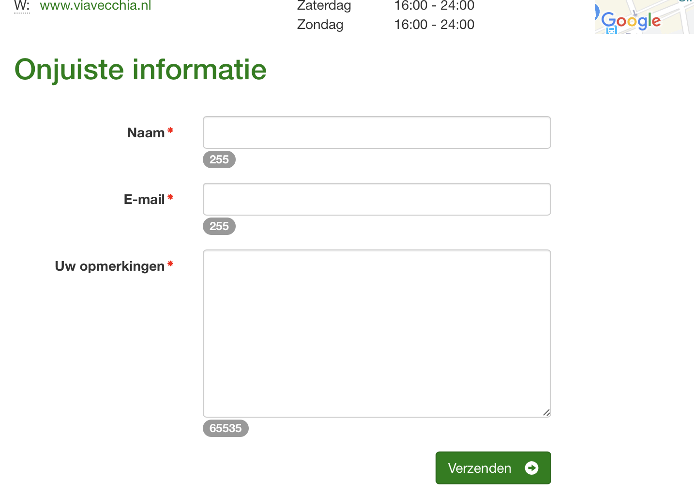

<!-- .slide: data-menu-title="www.Toegankelijk Groningen.nl" data-background-image="images/TG-Home.png" data-background-opacity="0.2" -->
## www.ToegankelijkGroningen.nl

vind snel wat je zoekt  
op elk device  
 
**Korte handleiding**

Note:
  Initial setup reveal.js presentation
    Create Github repository and 'git clone' repository to the local Projects folder
    Copy all files excluding the .git folder from another reveal setup into this folder
    Edit the slides.md in VsCodium to make the reveal.js presentation
    Stage all changes and commit them to GitHub
    ###
  Reveal.js is a webserver presentation, so start server in slides directory
     View live website via extension "Live server": Start "Go live" in bottom bar.
  Hidden features:
  - Speaker notes window : hit »S« on your keyboard.
  - Pause presentation :  hit »B« or ».«
  - Show menu: hit »M«
  Printing
  -  http://localhost:8000/?print-pdf
  -  http://localhost:8000/?print-pdf&showNotes=true
  -  Open the in-browser print dialog (CTRL/CMD+P).
    -  Change the Destination setting to Save as PDF.
    -  Change the Layout to Landscape.
    -  Change the Margins to None.
    -  Enable the Background graphics option.
    -  Click Save

---

## Toegankelijk Groningen

Snel vinden wat je zoekt:

- via het snelzoek menu
- via Zoeken op de kaart
- via (sub)categorie structuur

Aan de hand van enkele screenshots

Note:
- 
- Feedback geven
- Vergelijken van alternatieven
- Vast/Mobiel gebruik identiek?

---

<!-- .slide: data-menu-title="Zoeken via het snelzoek menu" -->
## Zoeken via het snelzoek menu

Je vindt het snelzoek menu hier:

In dit menu heb je 3 elementen:
1. Plaats: de vestigingsplaats, bijv. Groningen
2. Categorie: de categorie, bijv. Horeca
3. Beperking: bijv. Mobiliteit
 
Maak je keuze en klik op "Zoeken" om het snelzoeken te starten.

--

<!-- .slide: data-menu-title="Zoekresultaten" -->
**Zoekresultaten**

Resultaten kunnen worden vergeleken

--

<!-- .slide: data-menu-title="Objectvoorbeeld" -->
## Objectvoorbeeld

Gebruikers feedback mogelijk

--

<!-- .slide: data-menu-title="Rapporteer onjuiste informatie" -->
## Onjuiste informatie rapporteren

--

<!-- .slide: data-menu-title="Zoekresultaat rubrieken" -->
## Zoekresultaat - Gegevens

- Algemeen, Openingstijden, OV, Parkeren
- Aanlooproute, Entree
- Overnachten/Hotel, Sanitair, Verdiepingen
- Aanpassingen. Voorzieningen, Assistentie
- Zichtbeperking, Hoorbeperking

---

<!-- .slide: data-menu-title="Zoeken op de kaart" -->
## Zoeken op de kaart

Geef toestemming om locatie te gebruiken.

--

<!-- .slide: data-menu-title="Zoekresultaat kaart" -->
## Zoekresultaat kaart

[Kies object en bekijk detail informatie](#/2/4)

---

<!-- .slide: data-menu-title="Zoeken via (sub)categorie" -->
## Zoeken via Categorie

Hoofdcategorie

Klik op een hoofdcategorie

--

<!-- .slide: data-menu-title="Subcategorie Horeca" -->
## Subcategorie lijst Horeca

Kies een subcategorie om de resultaten te tonen

--

<!-- .slide: data-menu-title="Subcategorie Restaurant" -->
## Subcategorie Restaurant

[Bekijk object](#/2/4) of vergelijk

Note:
<a href="#/some-slide">Link</a>
   

---

<!-- .slide: data-menu-title="Toekomst Platform Toegankelijk Groningen" -->
## Toekomst Platform Toegankelijk Groningen
- Benaderd door Marketing Groningen
  - Toegankelijkheid Waddengebied
  - Open voor samenwerking v.w.b. Toegankelijkheid
- Potentiele boost voor platform
- Mogelijkheid wordt momenteel onderzocht
  - kosten inzichtelijk
  - fondswerving loopt goed

---

<!-- .slide: data-background-image="images/Thats_all_Folks.jpg" data-background-opacity="1.0" -->

--

<!-- .slide: data-menu-title="Live demo" -->
## Live website demo

<a href="http://www.ToegankelijkGroningen.nl">www.ToegankelijkGroningen.nl</a>
